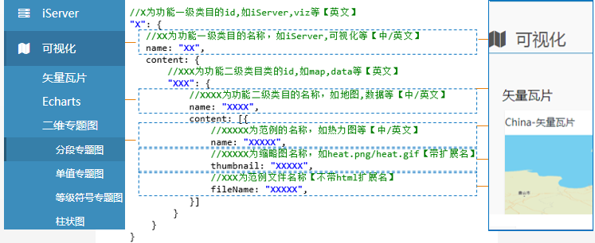

## 范例编写原则说明

1. [目录结构](#example-1)
2. [完整步骤](#example-2)
3. [范例创建](#example-3)
   * [脚本引用](#example-3-1)
   * [服务地址](#example-3-2)
   * [统一样式](#example-3-3)  
4. [缩略图规范](#example-4)
5. [配置文件](#example-5)
6. [离线开发](#example-6)
   * [克隆代码](#example-6-1)
   * [开发](#example-6-2)
7. [注意事项](#example-7)


<h3 id="example-1">目录结构</h3>

范例目录结构：
``` 
          /example
              ├─css         公共css目录
              ├─fonts       公共字体目录
              ├─img         公共图片目录
              ├─js          公共js目录
              ├─section     公共模板目录(包括范例站点的公共头部和主体框架等)
              ├─data        范例中使用的公共数据
              │
              ├─leaflet         leaflet范例目录
              │   ├─img             缩略图目录
              │   └─config.js       配置文件
              ├─mapboxgl        mapboxgl范例目录
              │   ├─img             缩略图目录
              │   └─config.js       配置文件
              ├─openlay         openlay范例目录
              │   ├─img             缩略图目录
              │   └─config.js       配置文件
              ├─classic         classic范例目录
              │   ├─img             缩略图目录
              │   └─config.js       配置文件
              └─3dwebgl         3dwebgl范例目录
                  ├─img             缩略图目录
                  └─config.js       配置文件  
  
  
```

<h3 id="example-2">完整步骤</h3>

   1. 在对应的客户端根目录下创建范例(具体规范请参考：[范例创建](#example-3))
   2. 截取范例缩略图(具体规范请参考：[缩略图规范](#example-4))，并存放到对应的客户端目录下img目录
   3. 修改对应的客户端根目录下的`config.js`文件(具体参数请参考：[配置文件](#example-5))

<h3 id="example-3">范例创建</h3>

 示例如下：
 
 ```html
    <!DOCTYPE html>
    <html>
    <head>
        <meta charset="utf-8"/>
        <title>quick start</title>
        <script type="text/javascript" include="bootstrap-css" src="../js/include-web.js"></script>
        <style>
            html, body {
                width: 100%;  height: 100%;  margin: 0;  padding: 0;
            }
            #map {
                width: 100%;  height: 100%;
            }
        </style>
    </head>
    <body>
    <div id="map"></div>
    <script type="text/javascript" src="../../dist/include-leaflet.js"></script>
    <script>
        //your code
    </script>
    </body>
    </html>
 ```
 为满足多元化使用需求，请将示例中的服务地址修改如下：
  ```javascript
 
        var host = window.isLocal 
                 ? window.server
                 : "http://[public iServer domain/ip]:8090";
        var mapUrl=host+"/iserver/services/map-world/rest/maps/World";
        //other code 
        //...   
  ```
    
 <h4 id="example-3-1">脚本引用</h4>

   以leaflet为例
      
   引入脚本主要有两个：
      
   `/example/js/include-web.js`: 引入web相关库（如：jquery，bootstrap），所有库都使用公共CDN地址
      
   `/dist/include-xxx.js`: 引入gis相关库（如：leaflet，iclient-leaflet，d3,echarts），除iclient的库之外，所有库都建议使用公共CDN地址
   
      
   * web相关库: 如果需要jquery，bootstrap等web相关库，引入`/example/js`公共目录下的`include-web.js`，引入格式如下：
   
     ```html
       <script type='text/javascript' include='XXX,XXX'  src='../js/include-web.js'></script>
     ```
     * `include`属性: 引入需要使用的库。多个库用","号隔开。没有默认引入的库
     * 没有`exclude`属性
     * include中参数的具体值参考`include-web.js`
     
   * gis相关库：script标签引入`dist`目录下的`include-leaflet.js`脚本，格式如下：
   
      ```html
        <script type='text/javascript' include='XXX,XXX' exclude='XXXX,XXXX' src='../../dist/include-leaflet.js'></script>
      ```
     * `include`属性: 需要使用的库(如leaflet相关插件,d3,mapv等)，多个库用","号隔开。默认引入的库不用再次填加。
        默认引入的库：客户端（leflet/openlayers/mapboxgl/iclient8c）相关库以及其对应的iclient相关库。如在本例(leaflet)中，默认引入的是：
        `leaflet.js`,`leaflet.css` ,`iclient-leaflet`，`iclient-leaflet-css`
     * `exclude`属性: 排除默认引入的库，多个库用","号隔开。
     * `include`和`exclude`中参数的具体值参考`include-xxx.js`
     
   * 新增库：如果`include-web.js`或者`include-xxx.js`中没有需要的库，则参照以下方法引入三方库：
     
     * 找到`include-web.js`或者`include-xxx.js`中的load方法
     * 在load方法末尾添加如下代码:
   
   ```javascript
         if (inArray(includes, 'xxxx')) {//'xxxx'为引入include-XXX.js的script标签中include属性的值
            inputCSS(" libs CDN url");
            inputScript("libs CDN url");
         }
   ```
   * 建议使用CDN地址。 推荐的公共CDN：[BootCDN](https://www.bootcdn.cn) ([https://www.bootcdn.cn](https://www.bootcdn.cn))
        
<h4 id="example-3-2">服务地址</h4>
  
   公共iServer服务地址: [https://iserver.supermap.io](https://iserver.supermap.io)
   
   可指定其他公网可访问的iServer地址

   
 <h4 id="example-3-3">统一样式</h4>

   * 底图建议全屏
   * 页面样式优先使用bootstrap，建议不要使用原生的HTML样式
   * 等待加载界面
        * 引入`include-web.js`脚本的script标签include属性中添加loader
        * 显示loader: ```showLoader()```
        * 移除loader: ```removeLoader()```
   * ...等待补充
   

 

<h3 id="example-4">缩略图规范</h3>
  
   * 建议大小：260*208（1:0.8），PNG8格式压缩
   * 有动态效果的界面缩略图建议也使用gif格式动图
   * 存放目录：对应客户端下的img目录（如`/example/leaflet/img`）


<h3 id="example-5">配置文件</h3> 
    
 每个客户端范例目录(如：`/example/leaflet`)下都有一个`config.js`文件，文件在站点初始化时读取。
 
 `config.js`中范例相关的配置项为`exampleConfig`，参数如下：
 
 左边为侧边栏菜单，右边为示例列表
 
 


<h3 id="example-6">离线开发</h3> 

<div style="color:red">离线开发需要内部权限，非授权用户请直接忽略。</div>

为了使站点和示例在离线状态(如iServer中)能够正常使用，需要增加并修改另一个项目

<h4 id="example-6-1">克隆代码</h4>

  离线开发项目地址：[https://gitee.com/isupermap/iclient-web](https://gitee.com/isupermap/iclient-web)

  * clone代码到本地
  * 更改项目目录名为web
  * 将项目移动到你的iclient项目的根目录下,与example同级
  
<h4 id="example-6-2">开发</h4>

**【脚本的使用跟在线的脚本一样，区别在于三方库全部为本地托管（`/web/libs`)】**

离线开发涉及修改的相关的目录为：`/example`目录，`/web/build`目录，`/web/libs`目录

* `/web`: 站点目录

    * `/web/build`：离线引用脚本目录   

    * `/web/libs`：离线三方库存放目录

* `/example`：范例目录 


#### /web

脚本的使用跟在线的脚本一样，只不过路径不同，在具体范例中通过script标签引入`/web/build/`下的脚本

相关的脚本为 `/web/build/include-xxx.js`和 `/web/build/include-web.js`,

* `/web/build/include-web.js`: 引入web相关库（如：jquery，bootstrap）(使用相对路径)，相关库的存放目录为`/web/libs`

* `/web/build/include-xxx.js`: 引入gis相关库（如：iclient-leaflet，leaflet）(使用相对路径)，相关库的存放目录为`/web/libs`


* 新增库：如果`include-web.js`或者`include-xxx.js`中没有需要的库，则参照以下方法引入三方库：
  * 下载三方库到本地
  * 将三方库按文件夹移动到`/web/libs`目录
  * 在三方库中的js文件中加上三方自己的版权标识(如果原先没有的话)，版权标识包括但不限于版权所有者，开源协议，软件版本等
  * 找到`include-web.js`或者`include-xxx.js`中的load方法
  * 在load方法末尾添加如下代码，注意路径必须是：`../../web/libs`
  
 ```javascript
        if (inArray(includes, "xxx")) {//"xxx"为引入include-XXX.js的script标签中include属性的值
           inputCSS("../../web/libs/name.css");//name为插件的名称
           inputScript("../../web/libs/name.min.js");//name为插件的名称,使用压缩后的脚本
        }
 ```

#### /example
   
   离线环境下范例除了修改引入的脚本（引入/web/build目录下的脚本）外，还需要修改范例服务地址。
   ```html
       <!DOCTYPE html>
             <html>
             <head>
                 <meta charset="utf-8"/>
                 <title>quick start</title>
                 <script type="text/javascript" include="bootstrap-css" src="../../web/build/include-web.js"></script>
                 <style>
                     html, body {
                         width: 100%;  height: 100%;  margin: 0;  padding: 0;
                     }
                     #map {
                         width: 100%;  height: 100%;
                     }
                 </style>
             </head>
             <body>
             <div id="map"></div>
             <script type="text/javascript" src="../../web/build/include-leaflet.js"></script>
             <script>
                 //your code
             </script>
             </body>
             </html>
   ```
   
   
   离线环境中，范例与服务【一般】在同一域下。保证范例在离线时使用的是本地的服务，所以需要修改范例中使用的地址（如地图服务，数据服务等地址）为：`http://localhost:port/xxx`。
   
   而为保证范例同时在离线和在线状态都能正常使用，建议修改示例中的服务地址如下：
   
   ```javascript

       var host = window.isLocal 
                ? window.server
                : "http://[public iServer domain/ip]:8090";
       var mapUrl=host+"/iserver/services/map-world/rest/maps/World";
       //other code 
       //...   
   ```

<h3 id="example-7">注意事项</h3>

暂无

                               


  

